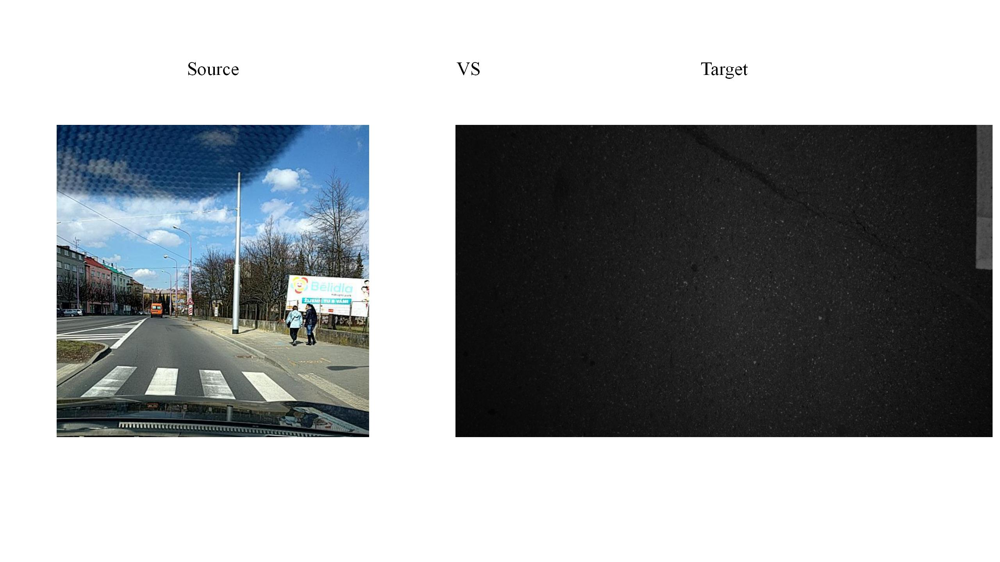
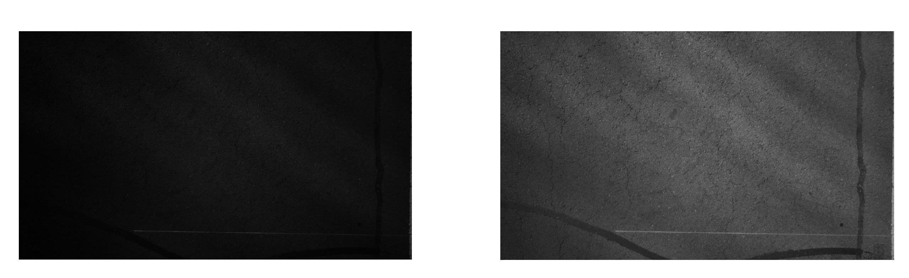
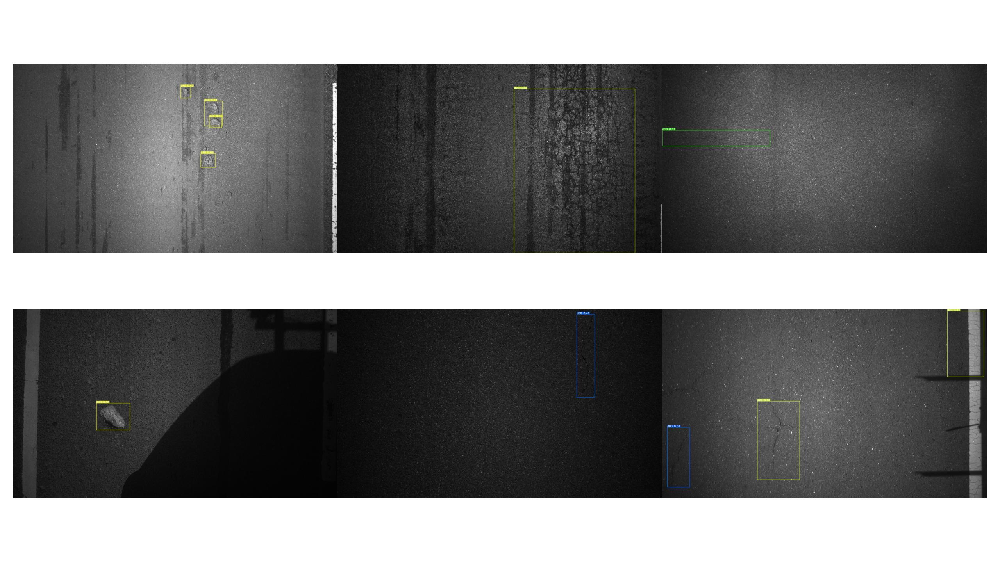

# 道路病害检测域适应项目 (Road Damage Detection with Domain Adaptation)

本项目针对道路病害检测中的**高标注成本**和**显著域间差异**问题，提出了一种基于改进YOLOv5的域自适应解决方案。通过引入MK-MMD对抗损失和自适应光照增强模块，在无标注目标域数据上实现了高效迁移学习。

---

## 数据与方法可视化

### 源域 vs 目标域图像对比

*左：源域RDD2020数据集样本 | 右：目标域原始图像（低光/模糊）*

### 自适应光照增强(APAGE)效果

*左：原始过暗图像 | 右：APAGE增强后效果*

### 数据标注效果展示

*目标域数据经过域适应后的自动标注结果可视化*

---

## 📦 开源资源获取

1. **预训练权重**（YOLOv5s-RDDC2020）:  
   [yolov5s_rddc.pt 下载地址 (Quark)](https://pan.quark.cn/s/1ebfbceaf519)

2. **域融合权重**（DA训练后）:  
   [yolov5s-da-best.pt 下载地址 (Quark)](https://pan.quark.cn/s/10f7aa927de5)

3. **源域数据集**:  
   [rddc_yolo.tar 下载地址 (Quark)](https://pan.quark.cn/s/91f94da37a1c)

4. **目标域数据集**:  
   [my_road_rgb.tar 下载地址 (Quark)](https://pan.quark.cn/s/0968c299d25b)

5. **官方预训练权重**（可选）:  
   [yolov5s.pt 下载地址 (Quark)](https://pan.quark.cn/s/f22df190c7ca)

---

## 📁 数据集目录结构

### 下载后需解压的两个压缩包：
```bash
# 源域数据集 (rddc_yolo.tar 解压后)
rddc_yolo/
├── images/
│   ├── train/
│   └── val/
└── labels/
    ├── train/
    └── val/
class_mapping.json  # 类别映射文件

# 目标域数据集 (my_road_rgb.tar 解压后)
rgb_images/
├── *.jpg
└── ...  # 共5000+张无标注图像
```

---

## 🔧 快速开始指南

### 1. 环境配置
```bash
# 创建Conda环境
conda create -n yoloda python=3.8
conda activate yoloda

# 安装依赖
git clone https://github.com/Xiaojingkuaipao/yolov5-domain-adaptation.git
cd yolov5-domain-adaptation
git checkout da
pip install -r requirements.txt
```

### 2. 数据准备
```bash
# 解压数据集
tar -xvf rddc_yolo.tar
tar -xvf my_road_rgb.tar
```

### 3. 分支切换说明
- **基础训练**（YOLOv5-RDDC2020）:  
  ```bash
  git checkout master  # 主分支用于基础训练
  ```
- **域适应训练**（DA模块开发）:  
  ```bash
  git checkout da       # da分支包含域适应核心代码
  ```

### 4. 权重配置
将下载的权重文件放置在项目根目录：
```bash
ls -l *.pt
# 应看到 yolov5s_rddc.pt 和 yolov5s-da-best.pt
```

### 5. 配置文件设置
- 修改 `my_cfg/target_data.yaml` 配置目标域路径：
  ```yaml
  train: path/to/your_rgb_images   # ✅ 指向移动后的目标域图像目录
  ```
- 修改 `my_cfg/rddc_2020.yaml` 配置源域数据路径：
  ```yaml
   train: path/to/your_rddc2020_train/*.jpg
   val: path/to/your_rddc_val/*.jpg    # ✅ 指向解压后的源域数据集
  ```

---

## 🚀 训练策略说明

### 两阶段训练流程
训练策略采用两阶段训练，需要让模型具有认识道路病害的能力，然后再迁移到我们自己的数据集上进行域间对齐，你可以从头训练，也可以使用我们在上面提供的预训练权重直接进行第二阶段的训练
1. **第一阶段：源域预训练**
   ```bash
   # 在 master 分支执行 使用方法参考YOLOv5官方仓库的v5.0使用方法
   python train.py \
     --weights yolov5s.pt \          # 官方预训练权重
     --cfg my_cfg/yolov5s.yaml \     # 网络配置
     --data my_cfg/rddc_2020.yaml \  # 源域数据配置
   ```

2. **第二阶段：域适应训练**
   ```bash
   # 切换到 da 分支并执行
   python train.py \
     --weights yolov5s_rddc.pt \     # 使用第一阶段权重
     --cfg my_cfg/yolov5s.yaml \     # 网络配置
     --data my_cfg/rddc_2020.yaml \  # 源域数据配置
     --target-data my_cfg/target_data.yaml \  # 目标域配置
     --da-layers [4, 6, 10] \        # MK-MMD作用层
     --da-weights [0.33, 0.33, 0.33] # 各层损失权重
     --name domain_adaptation       # 输出目录
   ```

## 检测应用
   ```bash
   # 切换到 da 分支并执行
    python detect.py --weights yolov5s-da-best.pt --img 640 --source path/to/your/images
   ```
---

## 📦 项目亮点
- **创新方法**：基于YOLOv5框架融合多核MMD（MK-MMD）域适应策略，实现源域（RDD2020）到目标域的特征空间对齐
- **光照优化**：自研自适应光照增强模块（APAGE），有效提升低光/过暗图像质量

---

欢迎提交Issue和Pull Request！